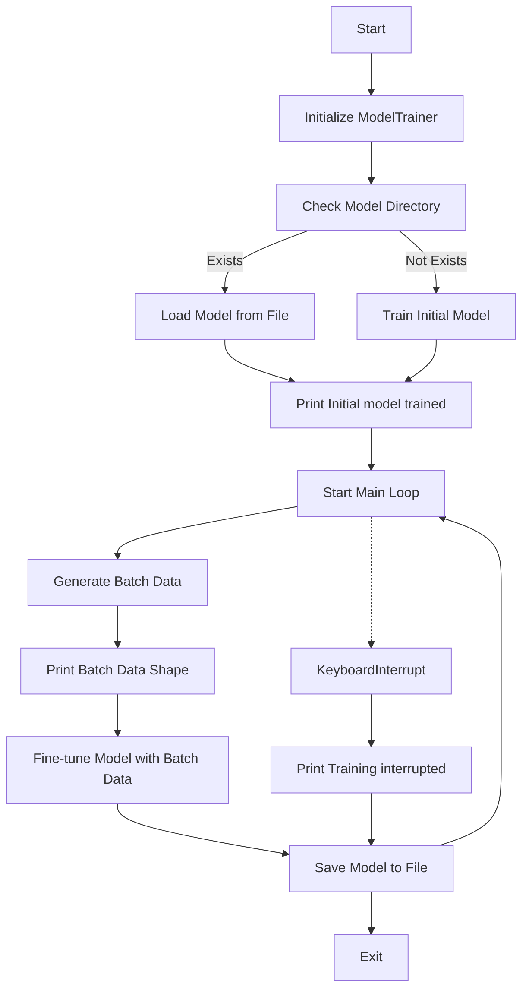
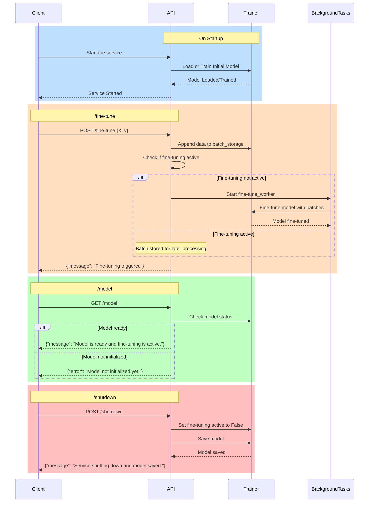

Asper AI Assignment

# Setting up environment

```python
pip install -r requirements.txt
```

# Steps to Execute

1. Trainer Code

From the Asper Project folder run the below command
```
python .\cli.py
```

2. API Code

```
uvicorn api:app --port 8000 
```

To test the API : http://127.0.0.1:8000/docs 

# Trainer Implementation

1. Start: The execution begins.

2. Initialize ModelTrainer:

        - Creates an instance of ModelTrainer.

4. Check Model Directory:

        - Calls _ensure_model_directory() to ensure that the model directory exists.

5. Load or Train Model:

        - If the model file exists, it loads the model from the file (_load_model()).
        - If the model file does not exist, it trains a new initial model (_train_initial_model()).

6. Print Messages:

        - Prints messages based on whether the model was loaded or trained.
7. Start Main Loop:

        - Enters the main loop to simulate streaming data.
8. Generate Batch Data:

        - Generates a batch of data using _generate_data().
9. Print Batch Data Shape:

        - Prints the shape of the generated batch data.
10. Fine-tune Model:

        - Fine-tunes the model using the new batch data (fine_tune()).
11. Save Model:

        - Saves the updated model to a file (save_model()).
12. Handle Keyboard Interrupt:

        - If interrupted by the user, it prints a message and saves the model before exiting.




# API Implementation

1. On Startup:

        - The client starts the service.
        - The API instructs the Trainer to load or train the initial model.
        - The Trainer responds once the model is loaded or trained.
        - The API confirms the service has started to the client.

2. /fine-tune:

        - The client sends a POST request to /fine-tune with batch data.
        - The API appends the batch data to batch_storage.
        - The API checks if fine-tuning is already active:
        - If not active, it starts the fine_tune_worker in the BackgroundTasks.
        - If active, the batch data is stored for later processing.
        - The API responds to the client that fine-tuning has been triggered.
3. /model:

        - The client sends a GET request to /model.
        - The API queries the Trainer for the model status.
        - The API responds with the model status to the client.
4. /shutdown:

        - The client sends a POST request to /shutdown.
        - The API sets fine-tuning active to False and instructs the Trainer to save the model.
        - The Trainer saves the model and responds back to the API.
        - The API confirms to the client that the service is shutting down and the model has been saved.

